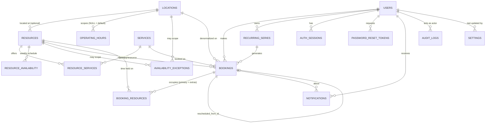

# Database Model — Generic Booking & Appointment Management System

PostgreSQL 16. Schema managed by Alembic (`backend/alembic/versions/`); entities defined in `backend/app/models/entities.py`, enums in `backend/app/models/enums.py`. Every table uses a `uuid` primary key (`UUIDPk` mixin); most carry `created_at`/`updated_at` (`Timestamps` mixin).

## 1. Entity-relationship diagram



*(Relationship cardinalities shown as declared; several foreign keys are nullable — e.g. a resource's `location_id`, a booking's `location_id` — so the "one" side is effectively optional throughout.)*

## 2. Tables

### `users`
| Column | Type | Notes |
| --- | --- | --- |
| `id` | uuid PK | |
| `name` | varchar(200) | |
| `email` | varchar(320) | unique, indexed |
| `phone` | varchar(50) | nullable |
| `password_hash` | varchar(255) | argon2id |
| `role` | enum `Role` | default `USER` |
| `status` | enum `UserStatus` | default `ACTIVE` |
| `created_at`, `updated_at` | timestamptz | |

### `auth_sessions`
Server-side record behind every issued JWT, so logout/reset really revoke it.
| Column | Type | Notes |
| --- | --- | --- |
| `id` | uuid PK | referenced as the JWT's `sid` claim |
| `user_id` | uuid FK → `users.id`, `ON DELETE CASCADE` | indexed |
| `created_at`, `expires_at` | timestamptz | |
| `revoked_at` | timestamptz, nullable | set on logout / password change |
| `user_agent` | varchar(500), nullable | |
| `ip_address` | varchar(64), nullable | |

### `password_reset_tokens`
| Column | Type | Notes |
| --- | --- | --- |
| `id` | uuid PK | |
| `user_id` | uuid FK → `users.id`, cascade | indexed |
| `token_hash` | varchar(128) | unique — the raw token is only ever in the e-mail link |
| `expires_at` | timestamptz | |
| `used_at` | timestamptz, nullable | one-time use |
| `created_at` | timestamptz | |

### `locations`
| Column | Type | Notes |
| --- | --- | --- |
| `id` | uuid PK | |
| `name` | varchar(200) | |
| `address` | text, nullable | |
| `timezone` | varchar(64) | IANA name, default `UTC` |
| `status` | enum `RecordStatus` | `ACTIVE`/`INACTIVE` |
| `created_at`, `updated_at` | timestamptz | |

### `resources`
| Column | Type | Notes |
| --- | --- | --- |
| `id` | uuid PK | |
| `location_id` | uuid FK → `locations.id`, `ON DELETE SET NULL`, nullable | indexed |
| `name` | varchar(200) | |
| `type` | enum `ResourceType` | `PERSON`, `ROOM`, `FACILITY`, `EQUIPMENT`, `VEHICLE`, `DESK`, `COURT`, `CUSTOM` |
| `description` | text, nullable | |
| `capacity` | integer, nullable | check: `NULL OR > 0` |
| `metadata` (column `metadata`, mapped as `attributes`) | jsonb | free-form, industry-specific attributes (e.g. `{"specialization": "Strength Training", "experience": 8}`) |
| `status` | enum `RecordStatus` | inactive resources take no new bookings |
| `created_at`, `updated_at` | timestamptz | |

### `services`
| Column | Type | Notes |
| --- | --- | --- |
| `id` | uuid PK | |
| `name` | varchar(200) | |
| `description` | text, nullable | |
| `duration_minutes` | integer | check `> 0` |
| `price` | numeric(12,2), nullable | |
| `capacity` | integer, nullable | check: `NULL OR > 0`; only meaningful for `CAPACITY` services |
| `booking_type` | enum `BookingType` | `INDIVIDUAL` (exclusive) or `CAPACITY` (shared session) |
| `buffer_before`, `buffer_after` | integer, nullable | minutes; check `NULL OR >= 0` |
| `status` | enum `RecordStatus` | |
| `created_at`, `updated_at` | timestamptz | |

### `resource_services`
Many-to-many join with per-link overrides. Composite PK `(resource_id, service_id)`.
| Column | Type | Notes |
| --- | --- | --- |
| `resource_id` | uuid FK → `resources.id`, cascade | PK part |
| `service_id` | uuid FK → `services.id`, cascade | PK part |
| `custom_duration` | integer, nullable | overrides the service's duration for this resource |
| `custom_price` | numeric(12,2), nullable | |
| `custom_buffer_before`, `custom_buffer_after` | integer, nullable | |
| `status` | enum `RecordStatus` | link can be deactivated without deleting either side |

### `operating_hours`
Business hours; `location_id = NULL` is the default set used by any location with none of its own.
| Column | Type | Notes |
| --- | --- | --- |
| `id` | uuid PK | |
| `location_id` | uuid FK → `locations.id`, cascade, nullable | indexed |
| `day_of_week` | integer | check `0..6` (0 = Monday) |
| `start_time` | time | |
| `end_time` | time | `end <= start` means the period runs past midnight |

### `resource_availability`
A resource's own recurring weekly schedule, interpreted in its location's timezone.
| Column | Type | Notes |
| --- | --- | --- |
| `id` | uuid PK | |
| `resource_id` | uuid FK → `resources.id`, cascade | indexed |
| `day_of_week` | integer | check `0..6` |
| `start_time`, `end_time` | time | multiple periods per day allowed |
| `valid_from`, `valid_until` | date, nullable | rule only applies within this window |
| `is_available` | boolean | default true; `false` rows carve a recurring gap (e.g. lunch break) out of the `true` rows |

### `availability_exceptions`
A date-specific change: a block, holiday, maintenance window, or special hours.
| Column | Type | Notes |
| --- | --- | --- |
| `id` | uuid PK | |
| `resource_id` | uuid FK → `resources.id`, cascade, nullable | indexed. Scope: set → one resource; only `location_id` set → every resource at that location; neither set → everything |
| `location_id` | uuid FK → `locations.id`, cascade, nullable | indexed |
| `start_datetime`, `end_datetime` | timestamptz | check `end > start`; indexed together for range queries |
| `type` | enum `ExceptionType` | `UNAVAILABLE`, `BLOCKED`, `HOLIDAY`, `MAINTENANCE` (all remove time) or `SPECIAL_HOURS` (replaces the recurring schedule for its dates) |
| `reason` | text, nullable | shown to customers/admins (e.g. "Deep clean") |
| `created_by` | uuid FK → `users.id`, `ON DELETE SET NULL`, nullable | |
| `created_at` | timestamptz | |

### `recurring_series`
Groups the bookings created by one recurring request.
| Column | Type | Notes |
| --- | --- | --- |
| `id` | uuid PK | |
| `user_id` | uuid FK → `users.id`, cascade | indexed |
| `service_id` | uuid FK → `services.id` | |
| `resource_id` | uuid FK → `resources.id` | |
| `frequency` | enum `RecurrenceFrequency`, nullable | `DAILY` / `WEEKLY` / `MONTHLY` |
| `interval` | integer | default 1 (every N days/weeks/months) |
| `occurrences` | integer | requested count |
| `first_start` | timestamptz | |
| `created_by` | uuid FK → `users.id`, `SET NULL`, nullable | |
| `created_at` | timestamptz | |

### `bookings`
The central table.
| Column | Type | Notes |
| --- | --- | --- |
| `id` | uuid PK | |
| `user_id` | uuid FK → `users.id` | indexed — the customer |
| `service_id` | uuid FK → `services.id` | indexed |
| `primary_resource_id` | uuid FK → `resources.id` | indexed |
| `location_id` | uuid FK → `locations.id`, `SET NULL`, nullable | denormalized for convenient filtering/timezone display |
| `start_datetime`, `end_datetime` | timestamptz | check `end > start` |
| `quantity` | integer | default 1; check `> 0`; seats requested for a capacity booking |
| `status` | enum `BookingStatus` | indexed — see the state machine below |
| `notes` | text, nullable | customer-entered |
| `price` | decimal(12,2), nullable | snapshot at booking time |
| `created_by` | uuid FK → `users.id`, `SET NULL`, nullable | who actually created it (self vs. admin) |
| `confirmed_at`, `completed_at`, `cancelled_at` | timestamptz, nullable | |
| `cancelled_by` | uuid FK → `users.id`, `SET NULL`, nullable | |
| `cancellation_reason` | text, nullable | |
| `conflict_reason` | text, nullable | set when a schedule change marks the booking `CONFLICTED` |
| `rescheduled_from_id` | uuid FK → `bookings.id`, `SET NULL`, nullable, indexed | links a replacement booking back to the one it replaced |
| `recurring_series_id` | uuid FK → `recurring_series.id`, `SET NULL`, nullable, indexed | |
| `created_at`, `updated_at` | timestamptz | |

Indexes: `(primary_resource_id, start_datetime)`, `(start_datetime)`, plus the individual FK indexes above.

Bookings are **never deleted** — cancelled and rescheduled bookings are kept for history and audit.

### `booking_resources`
The concurrency-safety table: exactly what time each booking holds on each resource, buffers included. A booking has one row here for its primary resource, plus one per additional resource in a multi-resource booking.

| Column | Type | Notes |
| --- | --- | --- |
| `id` | uuid PK | |
| `booking_id` | uuid FK → `bookings.id`, cascade | indexed |
| `resource_id` | uuid FK → `resources.id` | indexed |
| `occupied_start`, `occupied_end` | timestamptz | the booking's `[start, end]` **plus buffers** |
| `allocation_key` | varchar(200) | `x:<booking_id>` for an exclusive (individual) booking; a shared session key (service + start + end) for every seat of one capacity session |
| `active` | boolean | default true; set false when the booking's allocation is released (cancelled/rescheduled away) |

```sql
CONSTRAINT ex_booking_resources_no_overlap
  EXCLUDE USING gist (
    resource_id WITH =,
    tstzrange(occupied_start, occupied_end, '[)') WITH &&,
    allocation_key WITH <>
  ) WHERE (active)
```

This is the **database-level backstop**: two active rows for the same resource may only overlap in time if they share an `allocation_key` (i.e. they're seats of the same capacity session). Any other overlap is rejected by PostgreSQL itself, even if application-level checks were somehow bypassed. Indexed on `(resource_id, occupied_start, occupied_end)`.

### `notifications`
| Column | Type | Notes |
| --- | --- | --- |
| `id` | uuid PK | |
| `user_id` | uuid FK → `users.id`, cascade | indexed |
| `booking_id` | uuid FK → `bookings.id`, `SET NULL`, nullable | indexed |
| `type` | enum `NotificationType` | see the trigger list in `docs/functional-overview.md` |
| `channel` | enum `NotificationChannel` | `IN_APP`, `EMAIL`, `SMS`, `PUSH` |
| `title` | varchar(300) | |
| `body` | text | |
| `status` | enum `NotificationStatus` | `PENDING` → `SENT` / `FAILED` / `SKIPPED` (transactional outbox pattern) |
| `dedupe_key` | varchar(300), nullable, **unique** | guarantees a reminder is never recorded — and therefore never sent — twice |
| `read_at`, `sent_at` | timestamptz, nullable | |
| `error` | text, nullable | delivery failure detail |
| `created_at` | timestamptz | |

### `audit_logs`
| Column | Type | Notes |
| --- | --- | --- |
| `id` | uuid PK | |
| `actor_id` | uuid FK → `users.id`, `SET NULL`, nullable | indexed; who performed the action |
| `action` | varchar(64) | indexed, e.g. `BOOKING_RESCHEDULED`, `ADMIN_OVERRIDE`, `CONFLICT_RESOLVED` |
| `entity_type` | varchar(64) | e.g. `booking`, `resource` |
| `entity_id` | varchar(64), nullable | indexed |
| `old_value`, `new_value` | jsonb, nullable | before/after snapshots |
| `created_at` | timestamptz | indexed |

### `settings`
Single-row-per-key store for runtime-configurable booking rules (see `SETTING_DEFINITIONS` in `backend/app/services/settings_service.py`). No migration is needed to add a new tunable rule.
| Column | Type | Notes |
| --- | --- | --- |
| `key` | varchar(100) PK | e.g. `slot_interval`, `allow_waitlist` |
| `value` | jsonb | typed per key (int, bool, string, or list) |
| `updated_at` | timestamptz | |
| `updated_by` | uuid FK → `users.id`, `SET NULL`, nullable | |

## 3. Enumerations (`app/models/enums.py`)

| Enum | Values |
| --- | --- |
| `Role` | `USER`, `ADMIN`, `STAFF`, `RESOURCE_OWNER`, `MANAGER`, `SUPER_ADMIN` |
| `UserStatus` | `ACTIVE`, `INACTIVE`, `SUSPENDED` |
| `RecordStatus` | `ACTIVE`, `INACTIVE` (used by locations, resources, services, resource_services) |
| `ResourceType` | `PERSON`, `ROOM`, `FACILITY`, `EQUIPMENT`, `VEHICLE`, `DESK`, `COURT`, `CUSTOM` |
| `BookingType` | `INDIVIDUAL`, `CAPACITY` |
| `ExceptionType` | `UNAVAILABLE`, `BLOCKED`, `SPECIAL_HOURS`, `HOLIDAY`, `MAINTENANCE` |
| `BookingStatus` | `PENDING`, `CONFIRMED`, `COMPLETED`, `CANCELLED`, `RESCHEDULED`, `NO_SHOW`, `WAITLISTED`, `CONFLICTED` |
| `NotificationChannel` | `IN_APP`, `EMAIL`, `SMS`, `PUSH` |
| `NotificationStatus` | `PENDING`, `SENT`, `FAILED`, `SKIPPED` |
| `NotificationType` | `BOOKING_CREATED`, `BOOKING_CONFIRMED`, `BOOKING_RESCHEDULED`, `BOOKING_CANCELLED`, `BOOKING_REMINDER`, `WAITLIST_PROMOTION`, `RESOURCE_CHANGED`, `BOOKING_CONFLICTED`, `PASSWORD_RESET` |
| `RecurrenceFrequency` | `DAILY`, `WEEKLY`, `MONTHLY` |

All enums are stored as `VARCHAR` (`native_enum=False` in `_enum()`), not native PostgreSQL `ENUM` types — so adding a new value is a data-only change, never an `ALTER TYPE` migration.

## 4. Design patterns used in this schema

- **Soft deactivation over deletion.** `RecordStatus`/`UserStatus` give every catalogue entity and every account an `ACTIVE`/`INACTIVE` (or `SUSPENDED`) state; a delete only removes the row outright when there's no history attached (see FR-9 in the PRD).
- **JSONB metadata for industry-specific attributes.** `resources.metadata` avoids ever adding a business-specific column (see PRD §7).
- **Replacement-booking reschedule.** A reschedule is not an in-place update; it inserts a new `bookings` row and links it via `rescheduled_from_id`, so the full history of a booking's moves is preserved and a failed reschedule can never destroy the original (`Rule 13`).
- **Allocation table as the concurrency boundary.** `booking_resources` — not `bookings` — is what the exclusion constraint guards, which is what lets a capacity session's seats overlap each other (same `allocation_key`) while still forbidding any other overlap.
- **Transactional outbox for notifications.** A `notifications` row is written in the *same* transaction as the booking change, then delivered asynchronously by a background job — so a crash between "booking written" and "e-mail sent" can never lose or duplicate a notification (the `dedupe_key` unique constraint is the second half of that guarantee).
- **Runtime-configurable rules via a key/value table**, rather than hard-coded constants — the mechanism that lets one deployment behave like a different business without a code change (PRD §9, "Configurability").
