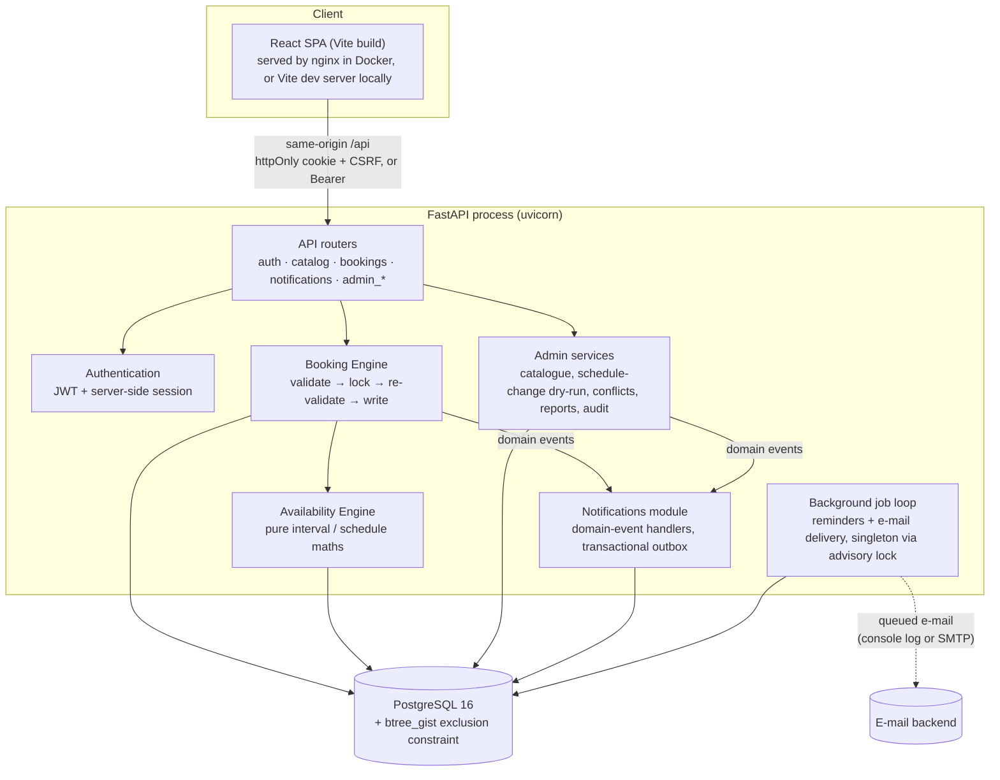
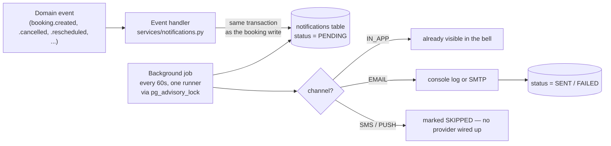
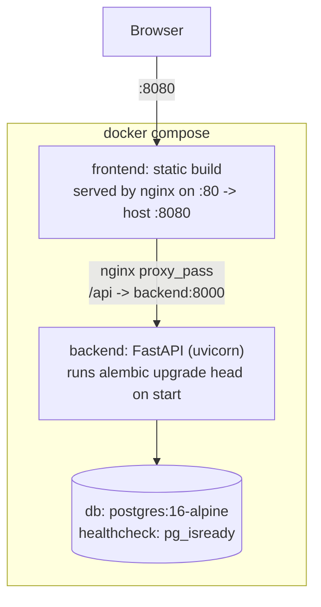

# System Architecture — Generic Booking & Appointment Management System

## 1. Overview

A three-tier web application: a React single-page app talks to a FastAPI REST API over same-origin HTTP, backed by a single PostgreSQL database that also enforces the system's core safety guarantee (no double-booking) at the schema level. A background process inside the API handles reminders and outgoing notifications. There is no separate services/microservices layer — the domain is small enough that a modular monolith, cleanly layered internally, is the right shape (see `docs/PRD.md` §2 for why the engine itself is generic).



## 2. Component responsibilities

| Component | Responsibility | Key files |
| --- | --- | --- |
| **SPA (React)** | Renders every screen; never decides availability or permissions itself — it only reflects what the API returns and re-sends the API's own error messages. | `frontend/src/` |
| **API routers** | HTTP boundary: request parsing/validation (pydantic), auth dependency injection, permission checks, response shaping. | `backend/app/api/routes/*.py`, `backend/app/api/deps.py` |
| **Authentication** | Password hashing, JWT issue/verify, server-side session table (so logout/reset really revoke access), rate limiting. | `backend/app/core/security.py`, `backend/app/api/deps.py` |
| **Availability Engine** | Pure computation: given a resource and a time window, what's free. No side effects, no writes. | `backend/app/services/availability.py`, `intervals.py`, `schedule.py` |
| **Booking Engine** | All writes that touch a booking: create, cancel, reschedule, reassign, confirm/complete/no-show, recurring, waitlist promotion. Owns the lock → re-validate → write sequence. | `backend/app/services/booking_engine.py` |
| **Admin services** | Catalogue CRUD, schedule-change dry-run/apply, conflict resolution, utilization reports, audit trail. | `backend/app/api/routes/admin_*.py`, `backend/app/services/schedule.py`, `reports.py`, `audit.py` |
| **Notifications** | Subscribes to domain events; writes in-app + queued e-mail rows in the same transaction as the triggering change. | `backend/app/services/notifications.py`, `events.py` |
| **Background jobs** | Every `JOB_INTERVAL_SECONDS` (default 60s): queue due reminders, dispatch pending notifications. Runs inside the API process; a PostgreSQL advisory lock makes sure only one replica does the work at a time. | `backend/app/jobs/runner.py` |
| **PostgreSQL** | System of record, and the final enforcement point for "never double-book" via an exclusion constraint — true even if every layer above it were bypassed. | schema in `backend/app/models/entities.py`, migrations in `backend/alembic/` |

## 3. Backend layout

```
backend/app/
  core/          config (env vars), security (argon2, JWT, rate limiter), permissions, timezone helpers, error types
  models/        SQLAlchemy entities + enums (see docs/database-model.md)
  db/            engine/session factory, declarative base
  services/
    intervals.py         half-open interval algebra (union / intersect / subtract)
    schedule.py           weekly rules + date overrides → concrete intervals (DST-safe)
    availability.py       the availability engine: snapshot, slot generation, slot validation
    booking_engine.py     create / cancel / reschedule / reassign / waitlist / recurring / conflicts
    notifications.py      domain-event handlers, reminder scheduling, delivery
    settings_service.py   runtime-configurable booking rules
    events.py, audit.py, reports.py
  api/
    deps.py        auth/permission dependencies, DB session, rate-limit dependency
    serializers.py response-shaping helpers
    routes/         auth.py, catalog.py, bookings.py, notifications.py, admin_bookings.py,
                     admin_catalog.py, admin_schedules.py, admin_system.py
  jobs/runner.py  background loop
  seed.py         demo data
  main.py         FastAPI app factory: middleware, security headers, router registration, lifespan
```

## 4. Frontend layout

```
frontend/src/
  api/          fetch client (client.ts: CSRF header, typed ApiError) + generated-by-hand TS types (types.ts)
  auth/         AuthContext: session state, permission checks, RequireAuth route guard
  components/   ui.tsx (design-system primitives), Layout.tsx (nav + notification bell), booking.tsx (slot picker, booking cards)
  pages/        public.tsx (home/services/resources/auth), account.tsx (dashboard, my bookings, profile), book.tsx (booking wizard)
  pages/admin/  overview, calendar, bookings, catalog (resources/services/locations), schedules, system (users/settings/audit), scheduleChange.tsx (the dry-run/apply modal shared by every admin screen that can shrink availability)
```

The router (`App.tsx`) is the same list of routes named in the original spec's §62, plus `/forgot-password`, `/reset-password`, `/admin/conflicts` and `/admin/audit`, which the implementation added.

## 5. Key request flows

### 5.1 Create a booking

```mermaid
sequenceDiagram
    participant U as Browser (customer)
    participant API as POST /api/bookings
    participant BE as BookingEngine
    participant AV as Availability snapshot
    participant DB as PostgreSQL

    U->>API: service_id, resource_id, start, quantity
    API->>BE: create(request)
    BE->>AV: build snapshot & check() (fail fast)
    AV-->>BE: rejected? -> 409/422 with a specific code
    BE->>DB: BEGIN; SELECT resource rows FOR UPDATE (sorted by id)
    BE->>AV: re-check against now-committed data
    AV-->>BE: still OK
    BE->>DB: INSERT booking + booking_resources row(s)
    Note over DB: exclusion constraint is the final guard
    BE->>DB: INSERT audit log (if an override was used)
    BE->>DB: publish domain event -> notifications written in the same COMMIT
    DB-->>API: COMMIT
    API-->>U: 201 Created (booking)
```

The validate-then-lock-then-re-validate shape is used for **every** write in the booking engine (cancel, reschedule, reassign, confirm, recurring, waitlist promotion) — see `docs/database-model.md` §4 and `docs/PRD.md` §9 ("Correctness under concurrency").

### 5.2 Reschedule

```mermaid
sequenceDiagram
    participant U as Browser
    participant BE as BookingEngine.reschedule()
    participant DB as PostgreSQL

    U->>BE: booking_id, new start/resource
    BE->>BE: validate the new slot (fail fast, nothing written yet)
    BE->>DB: BEGIN; lock old + new resource rows
    BE->>BE: re-validate against committed data
    BE->>DB: INSERT new booking (linked via rescheduled_from_id)
    BE->>DB: UPDATE old booking -> RESCHEDULED, release its allocation
    Note over DB: same transaction: a failure anywhere rolls back<br/>the ENTIRE reschedule, old booking stays exactly as it was
    BE->>DB: COMMIT
```

### 5.3 Admin schedule change (dry run → apply)

```mermaid
sequenceDiagram
    participant A as Admin
    participant SVC as apply_schedule_change()
    participant DB as PostgreSQL

    A->>SVC: e.g. new operating hours (dry_run=true)
    SVC->>DB: SAVEPOINT; apply the change; find now-affected bookings
    SVC->>DB: ROLLBACK TO SAVEPOINT (nothing persisted)
    SVC-->>A: "This change affects N existing bookings" + list
    A->>SVC: chosen action: keep / mark_conflicted / cancel (dry_run=false)
    SVC->>DB: BEGIN; apply the change for real; act on each affected booking
    SVC->>DB: audit log entry; notifications for affected customers
    SVC->>DB: COMMIT
```

Every admin action that can shrink availability — resource/location hours, a new block, resource deactivation, a location timezone change — goes through this one shared mechanism (`useScheduleChange` on the frontend, `apply_schedule_change`-style dry-run/apply on the backend).

## 6. Concurrency & data-integrity architecture

Two independent layers, deliberately redundant:
1. **Application layer** — resource rows are locked with `SELECT … FOR UPDATE`, sorted by id (prevents deadlocks between requests that touch overlapping resource sets, e.g. a multi-resource booking), then availability is re-checked against now-committed data before anything is written.
2. **Database layer** — a `btree_gist` exclusion constraint (`ex_booking_resources_no_overlap`, see `docs/database-model.md` §2 `booking_resources`) makes PostgreSQL itself refuse an overlapping active allocation on the same resource, regardless of what the application layer did or didn't check. This is what lets the system claim "never double-booked" as an invariant, not just a best effort.

Verified by dedicated concurrency tests in `backend/tests/test_concurrency.py`: ten simultaneous requests for one slot yield exactly one success; twelve simultaneous requests against a 3-seat class yield exactly 3 confirmed + 9 waitlisted; simultaneous cancellations promote exactly one waitlisted booking each.

## 7. Authentication & session architecture

- A JWT is issued on login/register, carrying the id of a server-side `auth_sessions` row (not the user's permissions — those are re-derived from the current role on every request).
- **Browser clients**: the JWT sits in an httpOnly, `SameSite=Lax` cookie; a separate, non-httpOnly CSRF cookie is echoed back as the `X-CSRF-Token` header on every state-changing request (double-submit pattern). GET requests need no CSRF token.
- **API/Bearer clients**: send `Authorization: Bearer <jwt>` directly; no CSRF check applies (a browser can't be tricked into replaying a header it never automatically attaches).
- Logout, and changing your password, **revoke the session row** — so the same JWT stops working immediately, everywhere, not just in the browser that logged out.
- Permission checks happen on every request via FastAPI dependencies (`require(Permission.X)`), never inferred from the frontend route the request happened to come from.

## 8. Notifications architecture



- Booking-engine and admin-service code never sends anything directly; they only `publish()` a domain event, keeping notification logic out of the booking rules (spec requirement).
- Writing the notification row in the same transaction as the state change (a **transactional outbox**) means a crash right after "booking confirmed" can never silently lose the confirmation message.
- Reminders are **queued**, not sent inline: the background job scans for bookings starting within the configured offsets and inserts a `BOOKING_REMINDER` notification with a unique `dedupe_key`, so re-running the scan (or running it on two replicas) can never double-send. Delivery is then a normal outbox dispatch.

## 9. Background job architecture

`run_once()` takes a PostgreSQL advisory lock before doing any work, so with N API replicas exactly one of them queues reminders and dispatches e-mail on any given tick — the others see the lock held and return immediately. This is the mechanism verified in `OPS-07` of the end-to-end test plan (two replicas, still exactly one reminder per booking).

> A production incident class this design has to guard against: the lock and the work must run on the **same** database connection, or a connection-pooled `Session` can return the lock-holding connection to the pool mid-job and release the lock from a *different* connection, which silently fails and leaves the lock stuck. `runner.py` takes the lock on one dedicated connection (`engine.connect()`, autocommit) and does the actual work in its own `Session`, precisely to avoid this. This was found and fixed during end-to-end testing — see `docs/e2e-test-results.md`, case `NTF-08`.

## 10. Deployment architecture



| Environment | Frontend | API | Start command |
| --- | --- | --- | --- |
| **Local development** | `http://localhost:5173` (Vite dev server, proxies `/api` to :8000) | `http://localhost:8000` (docs at `/api/docs`, dev only) | `uvicorn app.main:app --reload` + `npm run dev` |
| **Docker** | `http://localhost:8080` (nginx) | same origin, `/api` | `docker compose up --build` |

nginx (`frontend/nginx.conf`) also sets the SPA's own strict `Content-Security-Policy` and serves hashed static assets with a one-year immutable cache.

## 11. Technology stack

| Layer | Technology |
| --- | --- |
| Frontend | React 19, TypeScript, Vite, Tailwind CSS 4, React Router 7, TanStack Query 5 |
| Backend | Python 3.11, FastAPI, SQLAlchemy 2 (sync engine, `psycopg` v3 driver), Alembic, pydantic / pydantic-settings |
| Database | PostgreSQL 16, `btree_gist` extension |
| Auth | argon2id (via `passlib`/`argon2-cffi`), PyJWT |
| Deployment | Docker Compose (3 services), nginx (static frontend + reverse proxy) |
| Testing | pytest (backend, against a real PostgreSQL database), Playwright (end-to-end, both API-driven and browser-driven passes) |

## 12. Non-functional characteristics

- **Stateless API process** (aside from the in-memory rate limiter and the notification-job advisory lock, both designed to be safe or self-coordinating across replicas) — horizontal scaling is a matter of running more `backend` containers behind the same database.
- **Security headers** set on every response (`X-Content-Type-Options`, `X-Frame-Options`, `Referrer-Policy`, `Permissions-Policy`, `Cross-Origin-Opener-Policy`, a strict API-side CSP, HSTS when serving over HTTPS) — see `main.py`'s `security_headers` middleware.
- **Fails closed in production**: the app refuses to start with `ENVIRONMENT=production` if `JWT_SECRET` is left at its default or if `COOKIE_SECURE` is not enabled.
- **Observability**: structured audit log for every booking/schedule change and admin override; API docs auto-generated from the route definitions (disabled in production).
- **Schema evolution**: Alembic migrations, checked for drift with `alembic check` as part of the deployment smoke tests.
